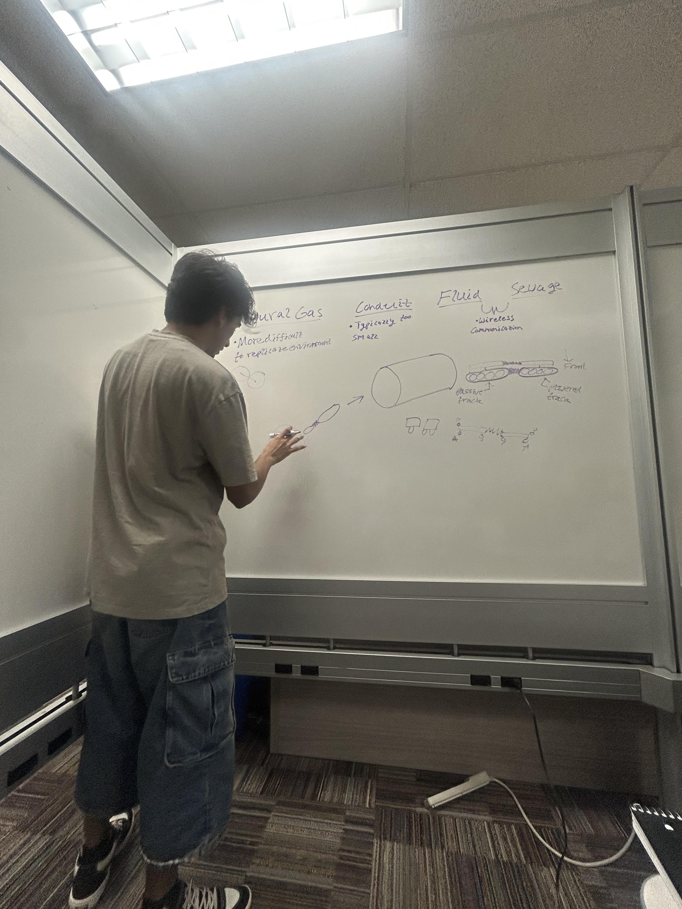
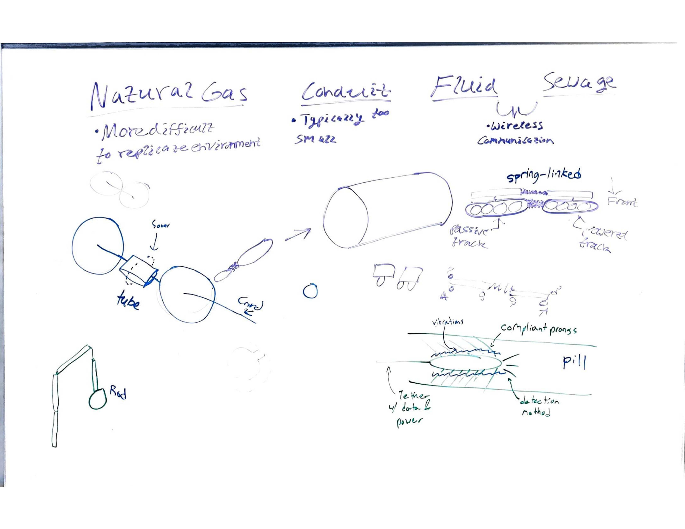
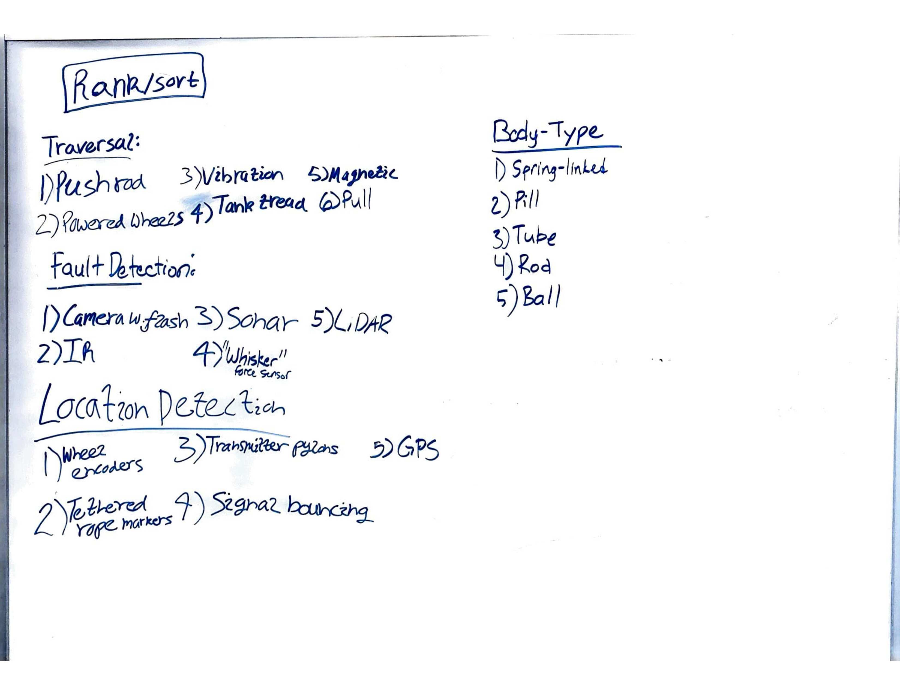

---
Concept Generation and Design Ideation Stages
--- 
**Project Description**

The primary goal of this project is to detect and identify various types of pipe defects and send the details from a robot to the user’s device. To accomplish this goal, the team must determine the traversibility of the robot, the optimization of detection with the use of some type of sensor, and the access of communication throughout the length of the pipe. Some things that the team may need to address are the diameter of the pipe, the length of the pipe, the distance that can be traveled before losing communication abilities with the user, and the different methods to detect the defects in the pipe.
_________________________________________________________
**Projected Audience Discussion**

Desired audiences for the project deliverable include construction and utility companies, as well as potential municipal customers. Pipes will be empty upon inspection by the deliverable and will be utilized in dry conditions. Construction companies, like SUNDT, can utilize the deliverable to mitigate damages and risk once the pipes are in operation by checking for cracks, blockages and objects penetrating into the pipe. Utility companies as well as municipalities can reduce outages through pre-installment inspection.

_________________________________________________________
**Initial Setup**

During the group concept generation meeting each team member introduced various ideas of traversal, fault detection sensors and packaging for the deliverable. At various points a member would approach the board and draw their idea for the deliverable as a whole, and this process continued until each member had contributed 4-5 different concepts across several established categories including body type, fault detection, location detection and Method of travel. Each idea was loosely drawn on the board to see similarities and differences between models.

Figure 1: An Image of the Early Concept Generation Process
__________________________________________________________
**Ideas Generated and Initial Feasibility**

A variety of ideas were proposed, including a pillbox type casing for the body of the deliverable, to a design that acts as a pushrod (bottom left of Figure 2) which can extend down the length of the pipe with sensors attached at the front. Conversation about how the deliverable would move included tank tracks versus wheels, as well as the possibility of a vibrating feature that propels the deliverable forward. For visual detection one group member proposed lidar, however this would likely prove to difficult to implement with the budget and time constraints. Sonar and a traditional camera setup are a more attractive option over lidar due to their cheaper cost and lessened complexity to implement. Additionally, our team discussed the types of pipes that could be considered for deliverable deployment, and the best environment for the purposes of this project appeared to be natural gas, water or sewage pipelines. 

Figure 2: Final State of the Main Concept Generation Board

__________________________________________________________

**Project Goals and Concepts Generated/Ranked**

The core goals of the project include detection of defects or faults, retrievability of the deliverable and connection to relay data collected, which may be wireless or tethered. The concepts generated were broken down into 4 categories: body type, fault detection, location detection and traversal.

Concepts Generated Table:  

| Traversal | Fault Detection | Location Detection | Body Type |
| --- | --- | --- | --- |
| Tank Tracks | Camera with Flash | Wheel Encoders | Pill Box |
| Powered Wheels | IR Sensor | Signal Bouncing | Ball Casing | 
| Vibration | Sonar Sensing | GPS | Tube Casing |
| Pulley System | Lidar | Transmitter Pylons | Nested Rod "Tent" Assembly | 
| Magnetic Track | "Whisker" Force Sensors | Tethered Rope Markers | Spring-Linked Assembly | 

Figure 3: Handwritten Concept Ranking/Sorting

**Rationale for Ranking**

Traversal:
	
  Our deciding factor regarding our method of traversal was our ability to fit our electronics inside the pipe. A pushrod mechanism would require the least amount of electronics inside the pipe, meaning our electronics would be less restricted by size. This leads to our second pick of powered wheels. This was our first idea for traversing through pipes, and remains as our most thought out. We brainstormed things like wheel count, wheel type, power delivery, and other specifications.

Fault Detection:
	
  Fault Detection was one of our most important categories, since this determines how our device completes its objective of detecting issues in the pipes it traverses. Our first pick is a camera with leds to provide light. This was one of our original ideas since it seemed like the easiest detection method since all analysis could be done by a human observer in real time. As opposed to our other methods of detection that would rely on numerical data and some software processing.

Distance Tracking:
	
  This category persists of our methods of tracking how far into the pipe our device is. This is to help the workers using the device determine where exactly the faults they detect are. This category also relied heavily on our traversal method, since some of our ideas like wheel encoders and tethers are only feasible if we choose the traversal methods that coincide with them. We put wheel encoders as our number one pick since regardless of if we use powered or passive wheels, we can utilize an encoder. A tethered rope was our second since it could simplify our power and communication systems by allowing us to route cables to the device inside the pipe.

Body Type:
	
  The body type of the device was our last category to rank since we came to the decision that the other three categories were both more important and influenced what body type we could choose. Our first idea was the spring linked design which took inspiration from long buses that have a linkage between their two carriages that allow them to turn corners. This would grant us more room for our electronics while still being able to take tight turns. Our second idea was the pill body, which just consists of a small tube like form that minimizes the space our electronics inhabit within the pipe.

**Video Presentation of Concepts Generated**

Team 310 Presentation: 

