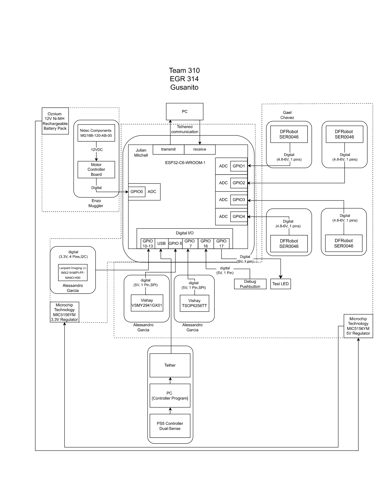

---
Block Diagram, Protocol, and Message Structure
---

There are a total of four subsystems that each team member is responsible for. Alessandro will be addressing the sensing technologies at the front of the deliverable, which include a camera and IR emitter/receiver setup. Gael will be responsible for developing the steering mechanisms fixed to the sides of the deliverable. Enzo's subsystem will consist of the motor to the drive the active wheel near the front of the device, as well as a motor control board that will send out the signal of distance traveled to the ESP32C6. Julian will be responsible for handling power distribution for the entire device, including connection, regulation and supply, as well as connection between the sensors and microcontroller.

